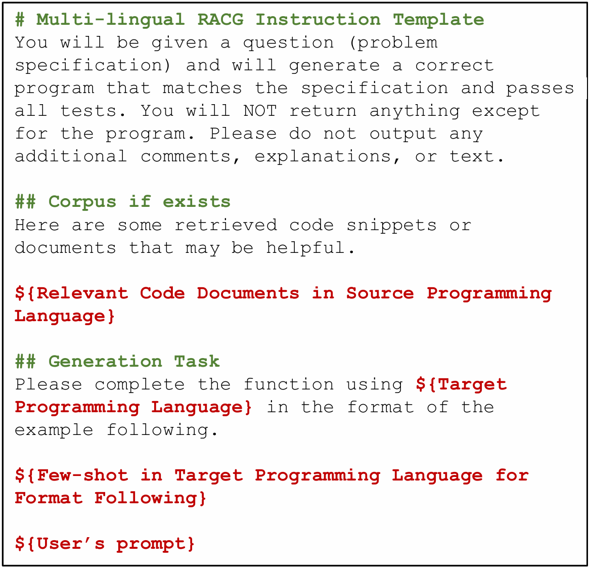

# Cross-Lingual-RACG

### Appendix

#### Prompt template in multi-lingual CodeRAG

*Figure: Unified prompt template for LLMs to generate code in multi-lingual CodeRAG.*

#### Instance distribution in Dataset

| Programming Language     | Correct Reference Solution Available |
|:------------------------:|:------------------------------------:|
| Python                   | 1181                                 |
| Kotlin                   | 1071                                 |
| Java                     | 1139                                 |
| Ruby                     | 1103                                 |
| Javascript (JS)          | 1133                                 |
| Php                      | 1158                                 |
| Typescript (TS)          | 1059                                 |
| C++                      | 1038                                 |
| C#                       | 1050                                 |
| Go                       | 905                                  |
| Perl                     | 1082                                 |
| Scala                    | 1054                                 |
| Swift                    | 937                                  |
| **Total**                | **13910**                            |

*Table: Instance distribution across 13 programming languages in Multilingual Code Dataset Expansion for CodeRAG (Total 13,910 instances)*